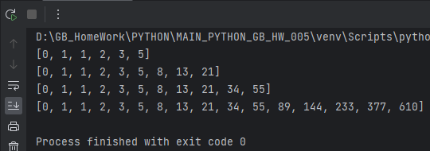

# Погружение в Python. Интераторы и генераторы

# Задача 1
Напишите функцию, которая принимает на вход строку - абсолютный путь до файла. 
Функция возвращает кортеж из трёх элементов: путь, имя файла, расширение файла.

**Пример выполнения**

# Задача 2
Напишите однострочный генератор словаря, который принимает на вход три списка 
одинаковой длины: имена str, ставка int, премия str с указанием процентов вида “10.25%”. 
В результате получаем словарь с именем в качестве ключа и суммой премии в качестве значения. Сумма рассчитывается как ставка умноженная на процент премии

**Пример выполнения**

# Задача 3
Создайте функцию генератор чисел Фибоначчи (см. Википедию)

**Пример выполнения**

